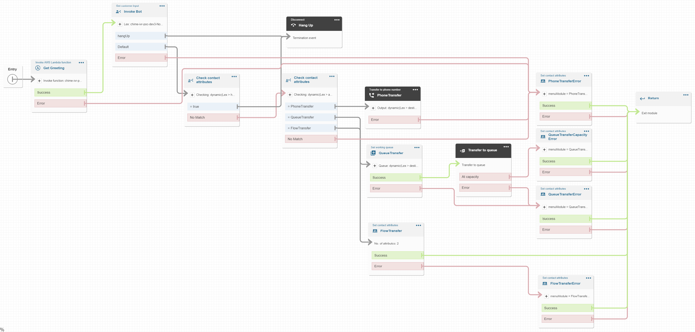
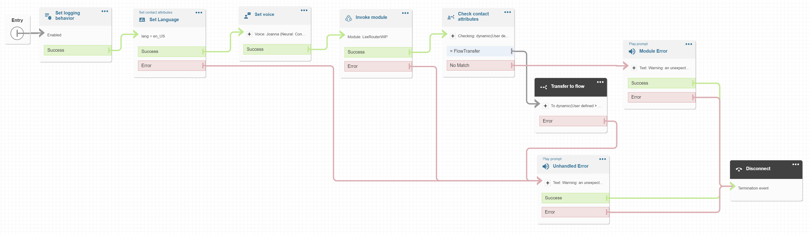

# Menu Bot

This construct uses Lex to map utterances to intents. The intents are associated with Actions.

## Current Actions

- Prompt: Play back text to speech
  - hangUp: If true, the bot will hang up, if false, the bot will offer more options
- PhoneTransfer: Transfer to an external number
- QueueTransfer: Transfer to a queue
- FlowTransfer: Transfer to a contact flow
  - This is not possible to do in a module, so you must act on attributes (See sample flow)
    - `menuModule`="FlowTransfer"
    - `menuModuleDestination`=`${FlowArn}`

## Customizations

In some cases, you may need to customize `MenuBot`, but you should always try to use the `customHandler` or `FlowTransfer` options first.

This allows you to maintain consistency in your MenuBot(s) and hand over control to another resource for the custom work. This reduces the impact of regression because the `MenuBot` code doesn't change, so you dont need to test as much with each release.

### Custom Handler

If you need to take an action on intent fulfillment, create a separate lambda and pass it to the bot as `action.customHandler`. The bot will invoke your lambda with the Lex event during the fulfillment step.

#### Custom Handler Examples

- Send the transcript (or any info) to the caller as a (Pinpoint) SMS message
- SMS message a webform to the caller so that they can fill out their address, etc. On post-back, write the data to a database
- Write the information about the interaction into a CRM

### Slot Capture and Bot Transfer

If you need to capture slot information you should implement a specialized bot and a new contact flow.

Example: When `MenuBot` matches the `PasswordReset` intent, use the `FlowTransfer` action to send the caller to your password reset flow/bot.

This encapsulates the Password Reset logic, making your integration easier to maintain and test.

## Connect Integration

The integration is implemented in a module and expects the `lang` attribute to be set before the module is called. This allows the integrator to either prompt for languages with with a bot, or pre-set the language in the entry flow.

If `lang` attribute is not set, `event.Details.ContactData.LanguageCode` will be used.

### Module

1. Get greeting for current language
2. Hand control over to Lex

   - The conversation flow is almost entirely in Lex to reduce latency

3. Check Lex Session attributes to determine the next step
4. If an error occurs, set the contact attribute to Error

   - Attribute Name: `menuModule`

### Sample Flow

This is a bare-bones example on how to use the module in your flows.

1. Set some defaults
2. Call the module
3. Handles the error

## Design Decisions

- Conversation flow should be handled in Lex
  - When the conversation loop is implemented within Amazon Connect, there is additional latency between prompts and responses.
  - To improve the latency we moved the conversation loop into the Lex handler
- Connect/Lex handler data should be static
  - To improve response times, the prompt/config data is passed to the Lambda using an environment variable `CONFIG`
  - This reduces latency and simplifies the bot by avoiding DDB lookups
  - CAVEAT: Environment Variables are limited to 4KB
    - If your app grows past this, you should figure out how pass that info another way
    - Suggestion 1: write the config to a temp file and bundle it into the lambda deployment. Use `readFileSync` to load it at runtime.
      - If your config file has tokens (queueArn, flowArns), you may need to write the file elsewhere (s3, ddb, parameter store, etc.)
    - Suggestion 2: Store the bot prompts in a standalone file then reference it from CDK and Lambda code. NodeJsFunction will bundle the reference file into the package so it is loaded with the code automatically.
